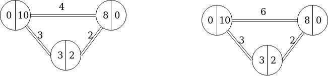
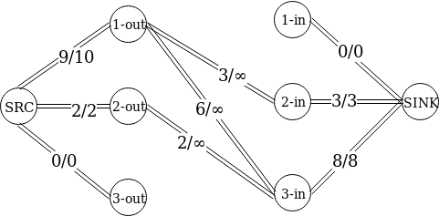
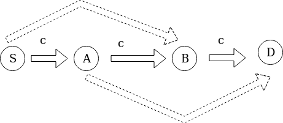
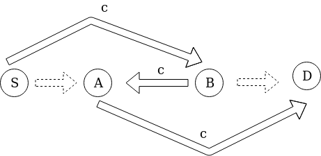
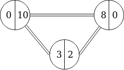

## Capacity

*TL;DR: Capacity is modeled at **flow level**(transport layer) assuming optimal TCP performance and no packet drops. The capacity is established in **rounds** of running an **allocation algorithm** for all active links in O(N<sup>3</sup> · log(N)).*

The Capacity package is the most important component of the simulator together
with the latency packages. Its design is inspired from:
- the flow-level simulator presented in the by [Kolja et al.](https://dl.acm.org/citation.cfm?id=1272986)
- [Peersim](https://www.researchgate.net/publication/220978873_PeerSim_A_scalable_P2P_simulator) cycle-driven simulation mode


The simulator is based on a **scheduler** which computes the transfer speed associated with each link in the topology. The scheduler runs periodically at an established period, by implementing the [Receiver](events.md) interface and **stopping the simulation to recalculate the transfer rates**.

The main assumption under which the simulator calculates the transfer rates are:
- equal share
- maximum capacity utilization


### Solution summary

We treat the problem as a flow one. Each link has an **upload and a download capacity** associated with it. We divide the computation in 2 phases:
 - In the first phase we
register all nodes interested in transferring data and extract only the links that are
relevant for those nodes(we call these links active links).

 - In the second phase, we
calculate the new capacities based on the upload and download capacities of the
upload and download capacities of the active links.

### Detailed solution

For calculating the capacities the equal share and full link utilization assumptions
are essential. Firstly, we calculate the in and out degree of a node. The in and out
degree of a node are useful to estimate the capacity of a link by the formula:

*capacity = min(capacity<sub>upload</sub> / degree<sub>out</sub>, capacity<sub>download</sub> / degree<sub>in</sub>)*

### Full link utilization - problem

Even though the formula above works for a single link, applying it to multiple links does not entail full link utilization, even though the equal share capacity is respected.



To exemplify this, take the scenario in the picture above. Node 1 has an download capacity of 0 with an upload capacity of 10, node 2 has capacities 3 and 2 and node 3 capacities 8 and 0. Now, if we apply the formula first to the link 1-3, we will have *capacity = min(10/2, 8/2) = 4*, yielding capacity 3 for link 1-2 and capacity 2 for link 2-3. However, we can observe that we can add 2 units of capacity for the 1-3 flow. Moreover, if we apply the formula first to the 1-2 link and 2-3 links, we can virtually eliminate those links since they are saturated, thus obtaining a capacity of *min((10 − 3)/1, (8 − 2)/1) = 6*.

### Full link utilization - Solution

Let us now try to solve the full link utilization problem. We can reformulate the
problem as a flow one. Each node tries to use as much of its upload capacity and we
also need to preserve the property that the data uploaded by a node on a connection
need to be downloaded by the node in the other end of the connection. We will thus
create a flow network with the source connected to each uploading end of a link and
the sink connected to each downloading end of the link. We allocate upload and
download capacities demanded by a node on the source and sink connections. The
connections between nodes will have infinite capacity. To exemplify this problem
formulation, we show the network built from the last example.



To solve the flow problem presented we can use the [Ford-Fulkerson algorithm](https://en.wikipedia.org/wiki/Ford%E2%80%93Fulkerson_algorithm), looking for the biggest augmenting path and reducing the flow on it. We can observe that due to saturating the augmenting paths early, a lot of flow will be sent backwards, violating the equal capacity assumption. We can prove by induction that the **augmenting paths found by the Ford-Fulkerson method can be transformed in capacity allocations** which respect the equal capacity assumption as denoted by capacity formula mentioned earlier.


#### Proof outline

<sub>This proof can be skipped at first reading.</sub>

Assume that the algorithm found the first augmenting path such that there with a forward connection which violates our invariant such that:

*capacity > min(capacity<sub>upload</sub> / degree<sub>out</sub>, capacity<sub>download</sub> / degree<sub>in</sub>)*

Now, it must be that since we found such a path that there is an outgoing edge from a node to B that was not allocated or similarly, there must be an edge from A to a node which was not allocated. Thus, it must be that we can find another augmenting path using one of those nodes. We will, thus, increase the value on those paths.



In this case, it means that the full capacity was not allocated for an outgoing connection from A and that the full capacity was not allocated for an incoming connection
to B. This is impossible since it would mean that the connection from A to B allocated more than it was allowed.



#### Greedy algorithm

By the previous arguments we can, thus, devise a greedy algorithm. We sort the
connections by *min(capacity<sub>upload</sub> / degree<sub>out</sub>, capacity<sub>download</sub> / degree<sub>in</sub>)*. Then we allocate the flow through the smallest capacity connection. The flow allocated will,
thus, be maximal for it. Afterwards, we eliminate the respective connection and update the costs with the new degree together with the remaining download and upload capacities. We finish when there are no more connections.

We use a binary heap to extract the minimum. To avoid the need of removing
elements from the heap, we assign a sequence number to each link. When we extract the minimum from the heap we check the sequence number and discard the entry if it is stale.

#### - Running example:



```
Denote {edge: node 1 - node 3, cost: 4, seq#: 1}
as {1-3, 4, #1}
Node 1: download 0, upload 10
Node 2: download 3, upload 2
Node 3: download 8, upload 0

Step 1: [{2-3, 2, #1}, {1-2, 3, #1}, {1-3, 4, #1}]
Step 2: [{1-2, 3, #1}, {1-3, 4, #1}],
capacity(2-3) = 2
Step 3: [{1-2, 3, #1}, {1-3, 4, #1}, {1-3, 5, #2}]
Step 4: [{1-3, 4, #1}, {1-3, 5, #2}],
capacity(1-2) = 3
Step 5: [{1-3, 4, #1}, {1-3, 5, #2}, {1-3, 6, #3}]
Step 6: [{1-3, 5, #2}, {1-3, 6, #3}]
Step 7: [{1-3, 6, #3}]
Step 8: [], capacity(1-3) = 6
```

We firstly introduce all the costs in the heap in step 1. At step 2 we pop the head of
the heap, calculating the capacity of connection 2 − 3 to be 2. At step 3 we have a
new capacity for connection 1 − 3 since the in-degree of node 3 changes to 1 and its
download capacity changes to 6. The new connection will have a bigger sequence
number.

At step 4 we pop the head and the capacity of connection 1 − 2 is calculated.
At step 5 we introduce the new capacity for edge 1 − 3 since the out-degree of node
1 changed. In steps 6 and 7 the head will be popped but discarded due to the
sequence number. Finally, in step 8 the head is popped and the capacity of edge
1 − 3 is calculated.

#### Complexity

The running complexity of the algorithm is *O(N<sup>3</sup> · log(N))*. Moreover, for topologies with limited number of neighbors per node(e.g. BitTorrent), we can bound the complexity to *O(N<sup>2</sup> · log(N))*.
