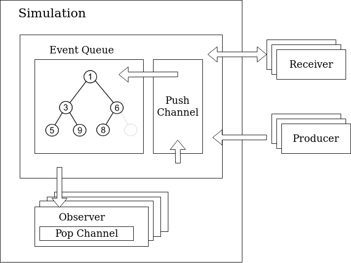

## Event Simulator

The Events module’s basic construction blocks are the **event queue** and the **events**. We have the following components:
- **Event** - data type with a payload, a time stamp and an attached Receiver
- **Receiver** - structure with handles an Event and produces another Event in
response
- **Event Queue** - priority queue ordered by timestamps which delivers
Events to Receivers

Given the fact that Receivers produce only Events at timestamps strictly bigger than the current timestamp, we can define the **Simulation time** which is the smallest time attached to an event in the event queue.

The **Receiver**-based system described so far is sufficient to produce a basic simulation. However, to allow monitoring the simulation and introducing new events, we define **Producers** and **Observers**:
- **Producer** - creates events such that their time is strictly increasing
- **Observer** - subscribes to events delivered to one/more Receivers

Finally, using this simple constructs we can define a Simulation:
- **Simulation** - an Event Queue, a shared global time and a set of Observers

### Event Queue

The Event Queue needs to be an efficient structure capable of handling multiple events in an efficient way. The underlying data structure chosen to implement the priority queue interface is a **binary heap**. Its complexity is **O(log N)** for both pushing and popping.

To improve the performance and allow parallel computation we extend the heap structure with a **push-only channel** with finite capacity. The push-only
channel is a FIFO queue which is used by a Receiver or Producer to enqueue a new Event. To preserve the strictly increasing time invariant, we make the **Event Queue lazy**, that is when a Pop operation happens, the channel is cleared, thus sorting the resulting events. To avoid the channel getting full, when the channel is close to getting filled we release the pressure by popping some of the elements in the queue.

#### Simulation workflow
- the event with the smallest timestamp is popped out of the priority queue
- when we pop the element we also notify all the observers associated with the event’s receiver
- registering an observer has priority over processing events,
- updating the time with the time of the current event is protected via a read-write lock

#### Safety and progress

*You can skip this section during the first read.*

We define a Progress via:
   - a **progress function** which should be called by a routine when progress is being made
   - an **advance function** that should block until a certain progress state has been achieved

The **Progress** runs inside a Receiver which periodically enqueues an event which checks for a progress property being made.

By using this simple mechanism we can define both progress and safety properties by, for example, using a semaphore to ensure that a group of routines ran during a certain time interval. This allows the possibility of using concurrent functions without degrading the correctness of the simulation.
