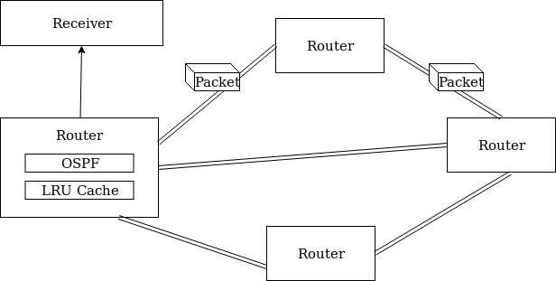
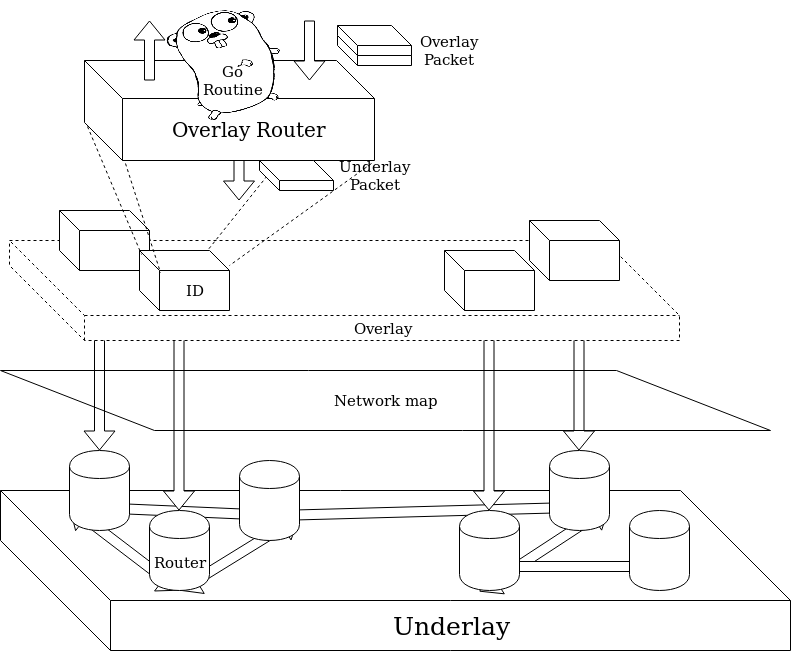
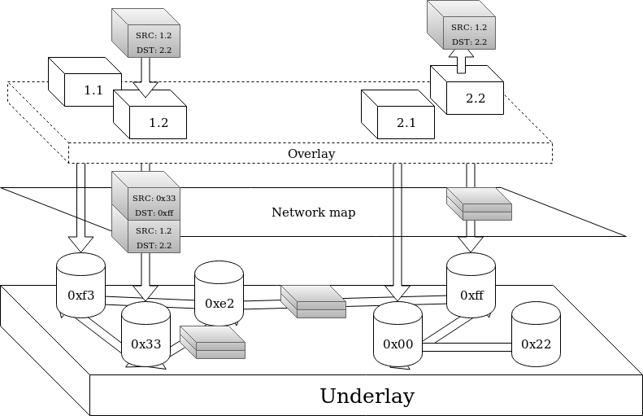

### Latency

*TL;DR: We model the latency at **packet level** using Bellman-Ford and caching to approximate OSPF. The topologies are realistic and generated automatically.*

We use the [Receiver](events.md) abstraction to implement a network of routers:
- **Router**: converts a received payload into a **Packet**
- **Packet**: source, destination, payload

Each router will redirect the packet to the next destination using an [OSPF](https://ro.wikipedia.org/wiki/OSPF)-like algorithm. The **latency** is simulated by pushing an event into the event queue at the `current time + link latency` to the next router.

  

#### OSPF

<sub> This section can be skipped if you are familar with OSPF. </sub>

The OSPF protocol is a link-state protocol used to redirect packets in the same autonomous system. Each router broadcasts a link-state advertisement with its link costs. As advertisements arrive, each router uses a Dijkstra shortest path variation to calculate a redirection table based on the destination demanded by a packet.

#### OSPF approximation

To simulate OSPF, we assume the topology to be known and fixed by each router, thus eliminating the link state advertisements.

The problem with using the Dijkstra’s algorithm and keeping the results is the memory used by a router is scalability. The OSPF protocol is designed for small topologies which do not require storage of large amounts of information. To overcome this impediment in real deployments, inter-AS routing algorithm such as BGP are employed. <sup> [we plan to implement this - take a look at the [roadmap](roadmap.md)] </sup>

This makes sense only in dynamical topology models as in a fixed topology setup the effect of suboptimal routes would be felt easily. Our solution preserves the optimality of routing while using only a small amount of resources and computation. We replace the Dijkstra’s algorithm with a **Bellman-Ford variation**, adding the path that the packet will follow as its payload. This results in a memory overhead of only *O(E)* as opposed
to the *O(N<sup>2</sup>)* complexity of Dijkstra. The time overhead is *O(V · E)*, with a *Θ(E)* complexity in the average case.

#### Caching

Our approach is not practical due to poor time performance, allowing us to simulate up to a few hundred nodes in real time. To improve its scalability we take advantage of the fact that our topology is static, caching the most used routes with a least-recently used caches.

The **LRU eviction policy** proves to be efficient, allowing us to simulate up to a few thousand routers on a single machine, in a single thread. The
memory usage allows running up to **100,000 nodes** since the only memory overhead is the LRU cache overheads. The memory complexity of the improved algorithm is *O(N · C)* where C is the cache capacity, giving *O(1)* time for routing when we hit the cache and *Θ(E)* time on average when missing it.

#### Why don't we precompute the paths?

We want our algorithm to be adaptable to changing topologies which support variable latencies and link failures. This will be implemented in the [future](roadmap.md).  

<sup>The sections below can be skipped during the first read. They descibe the implementation details and the topology generation algorithm. </sup>

### Topology generation

The reason why we choose to provide an underlying topology is the fact that realistic transport-level latencies are hard to produce using a simple distribution. To make the scenario more realistic, we use an adaptation of the [internetwork topologies](https://ieeexplore.ieee.org/document/493353) used for simulating peer-to-peer systems such as distributed hash tables. To make preserving the invariants in the paper easier, we do not use stub-stub connections.

We divide our topology into domains, each domain being either a transit or a stub domain. The totality of transit domains represents the backbone, whereas the stubs are domains attached to a node in the backbone. The graph is generated as follows:
- Generate the transit domain graph using a random graph generation algo-
rithm
- Generate graph from transit domain by replacing each node in the transit do-
main graph with a domain graph
- Add stubs to random nodes in the stub domain
- Generate multi-homed stubs randomly connecting some nodes in a stub do-
main to nodes in the backbone.

To generate a domain we use a simple random graph generation algorithm. As
mentioned [here](http://economics.mit.edu/files/4622), when the number of edges in a graph is *O(N log N)* the graph will be connected with high probability.

### Overlaying

Having the Underlay constructed, we need to add another layer of abstraction over
it in order to be able to provide clean interfaces for the user. The Overlay package is
an intermediary between the user and the latency part of the simulator, by providing
a runtime environment in which the user will be able to execute its custom code
aimed for a network node.



We will describe the Overlay package starting from the interface and going down
towards the underlay. The node interface provided is described as follows:
```go
interface {
  Join() string // name of another node in network
  Id() string // provides node id, used in packets

  Send() chan<- interface{} // send channel
  Recv() <-chan interface{} // recv channel
}
```

To implement the naming mechanism we use a **map structure** which associates
unique IDs of nodes with Router addresses. For simplicity, the ID is formatted as
`Domain.Node`, thus providing an automatic mean to detect the correct domain. This structure can be shared between multiple goroutines, being a **thread-safe** construct.

### Routing example



To give an overview of the routing mechanism we will go through a working example. Suppose that **node 1.2** wants to send a packet to **node 2.2**(node 2.2 might be, for example, node 1.2’s bootstrap node Join()).

To send a packet, the user will push the packet in the **Send()** channel with source 1.2 and destination 2.2 together with its payload. The Sender Goroutine will supervise the user channel and as the user pushes the packet, the routine will use the network map to extract the underlay source and destination, that is **0x33** and **0xff**.

The upper layer packet will be **embedded in the underlay level payload**. The packet will be afterwards passed to the router in the underlay. The routers in the underlay will use their shortest path algorithms to move the packet until it arrives at the destination router.

Node **0xff**’s [observer](events.md) will then be notified and the
Receiver routine will extract the decorated package from the observer. Afterwards it will strip the payload and deliver it directly to the user **Recv()** channel.

#### Note:

The **Send()** and **Recv()** channels have been replaces in the latest version of **Speer** for speed considerations. For more details, read the [optimization section](optimizations.md).
