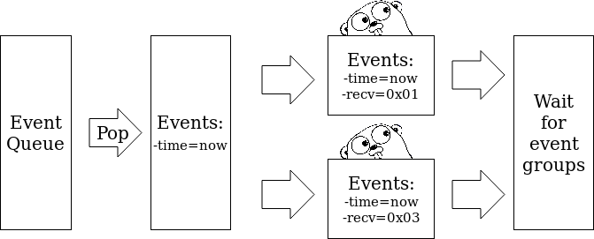

## Optimizations

#### Motivation

We looked at optimizations due to poor perfomance when simulation the BitTorrent protocol in the [CacheTorrent project](https://github.com/danalex97/nfsTorrent).

The time performance of the simulator was as expected in the case of using the
capacity-only mode. However, when both capacity and latency modules were running, the unexpectedly **large number of control messages** generated by the BitTorrent protocol caused major performance problems.

#### Eliminating channels

*TL;DR: We eliminate channel chains by exposing a proxy to upper layers. The upper layer overrides the proxy to decorate events before pushing in a channel.*

In the [initial implementation](latecy.md), we used Golang channels to interface between the layers of our architecture. Channels are a typed conduit through which the programmer
can send and receive values. By default, sends and receives block until the other side
is ready. This allows goroutines to synchronize without explicit locks or condition
variables.

##### The old solution

To interface between 2 different channels we used goroutines which would act as an
active proxy. We will call such routines proxy routines. The proxy routine would pull
a message from a channel, prepare a new message and push it into the second channel. Moreover, since we need to ensure that the push operations are instantaneous
with regards to the virtual time of the simulation, we used a shared semaphore to
ensure that all the proxy routines run at pre-established intervals. These intervals
need to be short(10ms) in order to preserve the latency distribution.

##### The new solution

During our profiling experiments, we found out that BitTorrent simulations would
spend a large amount of time waiting for the shared semaphore and produce larger
execution times due to the need for numerous context switches. To mitigate this
problem we eliminated the channels, passing the responsibility of message prepara-
tion towards the goroutine which wants to either push or pull a message. To achieve
this we refactored each layer to execute a callback on the message before pushing it
into a channel:

```go
// A Proxy is a function to be executed before pushing a message
// into a channel.
type Proxy func(interface {}) interface{}

// An interface is a "Decorable" if it provides a proxy to be set.
// Before a message is pushed into a channel the proxy should
// process the message.
type Decorable interface {
  SetProxy(Proxy)
}

// A "Decorator" is the implementation of a "Decorable".
type Decorator struct {
  Proxy
}
[...]

func (o *EventObserver) EnqueEvent(e *Event) {
  if e.Receiver() == o.receiver {
    // Call the proxy on the received message before delivering it.
    // The Proxy can be set by upper layers via SetProxy(Proxy).
    deliver := o.Proxy(e)

    if deliver != nil {
      o.observer <- deliver
    }
  }
}
```

#### Parallel event execution

*TL;DR: We deliver events that happen at the same timestamp in parallel if they need to be delivered to different Receivers.*

The routine switch overhead remained is a big part of the time component. To improve the performance of our routines we employed parallel event processing.



We observe that the **only order constraint** of our discrete event simulator is **time-related**. Moreover, for most receivers the time-stamp of the produced event will be strictly bigger than the current time-stamp. Therefore, this type of **receivers can be run at the same time** since they will not influence each other. We composed the following pipeline(presented in the picture above):

- pop all events with the time-stamp equal with *now*
- group all these events in event groups by the receiver address
- execute the receivers in parallel
- wait for all receivers to finish their execution

The pipeline proved better performance for multi-core machines. On a 2-core machine we simulated a topology of 200 nodes. When running the same simulation with the sequential queue the time taken was **237 seconds** as opposed to **188 seconds**, which is an improvement of almost **20%** for only 2 cores and a small scenario. For bigger topologies and more cores, the improvement is even larger, sometimes resulting in cutting the runtime in less then **50%**.

#### Replacing nodes running in goroutines to observers

We changed the interface of the node by adding the `OnNotify` method. This method will be triggered when the state of the channels related to a node changes(e.g. some data has been transferred or a control message arrived). To allow running other routines periodically, we provide the `util.Callback` and `util.Routine` interfaces.

This changes allow controlling the progress a program makes by moving a node's execution directly onto the simulator, thus eliminating the need for the Go Scheduler to schedule all routines associated with a node. Therefore, this approach guarantees progress if `OnNotify` gives the execution back to the simulator.  
